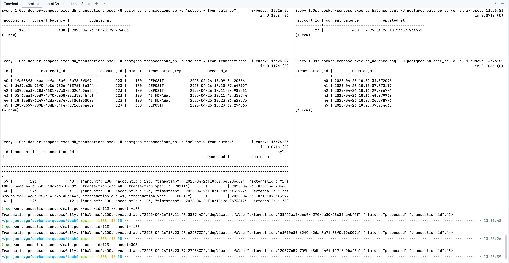

Запустить докер контейнеры
```shell
docker compose up -d
```

Команда отправки транзакции на сервер
```shell
go run transaction_sender/main.go --user-id=123 --amount=100
go run transaction_sender/main.go --user-id=123 --amount=-100
go run transaction_sender/main.go --user-id=123 --amount=100 --id=dc0e2340-c00b-43e4-8f78-a5f90f5bd872
```

```shell
watch -n 1 'docker-compose exec db_transactions psql -U postgres transactions_db -c "select * from balance"'
watch -n 1 'docker-compose exec db_transactions psql -U postgres transactions_db -c "select * from transactions"'
watch -n 1 'docker-compose exec db_transactions psql -U postgres transactions_db -c "select * from outbox"'
watch -n 1 'docker-compose exec db_balance psql -U postgres balance_db -c "select * from balance"'
watch -n 1 'docker-compose exec db_balance psql -U postgres balance_db -c "select * from inbox"'
```


