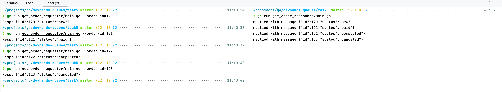

Run nats cluster
```shell
docker compose up -d
```

Run publisher
```shell
go run publisher/main.go
```

# Pub/Sub

Run subscribers
```shell
go run subscriber/main.go # subject = orders.*
go run subscriber/main.go --subject=orders.new
go run subscriber/main.go --subject=orders.paid
go run subscriber/main.go --subject=orders.completed
go run subscriber/main.go --subject=orders.canceled
```


# Queue worker

Run worker
```shell
go run queue_worker/main.go
```


# Requester/Responder

Run responder
```shell
go run get_order_responder/main.go
```

Send request for get order by id
```shell
go run get_order_requester/main.go --order-id=122
```
